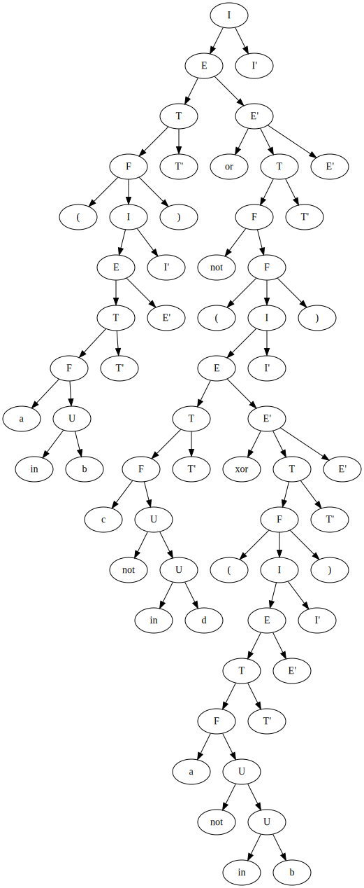

# Лабораторная работа 2. Ручное построение нисходящих синтаксических анализаторов.

#### Бандурин Владислав, М33321.

### Вариант 4. Логические формулы с множествами в стиле Python.

_Логические формулы. Используются операции and, or, xor, not, in.
Приоритет операций стандартный. Скобки могут использоваться для изменения приоритета._

_Предусмотреть возможность оператора not in.
В качестве операндов выступают переменные с именем из одной буквы. 
Используйте один терминал для всех переменных. Для каждой логической операции должен быть заведен один терминал (не три ‘a’, ‘n’,
‘d’ для and)._

_Пример: (a in b) or (c not in b)_

### Разработка грамматики.

Построим грамматику:

```haskell
I -> E
I -> E => I
E -> T
E -> E or T
E -> E xor T
T -> T and F
T -> F
F -> not F
F -> var U
F -> ( I )
U -> not U
U -> in var
```

она не LL(1), т.к. содержит левую рекурсию и правое ветвтление. Избавимся от них:

```haskell
I -> E I'
I' -> eps
I' -> => I
E -> T E'
E' -> or T E'
E' -> xor T E'
E' -> eps
T -> F T'
T' -> and F T'
T' -> eps
F -> not F
F -> var U
F -> ( I )
U -> not U
U -> in var
```

### Описание:

| Нетерминал |                Описание                |   
|:----------:|:--------------------------------------:|   
| E          |     Формула, стартовый нетерминал      |   
| E'         |         Продолжение выражения          |   
| T          |                  Терм                  |   
| T'         |           Продолжение терма            |   
| F          |                 Фактор                 |
| U          | Выражение с операциями над множествами |


| Терминал | Токен  |
|:--------:|:------:|
|    (     | LPAREN |
|    )     | RPAREN |
|  [a-z]   |  VAR   |
|   and    |  AND   |
|    or    |   OR   |
|   xor    |  XOR   |
|   not    |  NOT   |
|    in    |   IN   |
|    $     |  END   |


### Построим множества First и Follow для данной грамматики:


| Нетерминал |        First        | Follow                        |   
|:----------:|:-------------------:|-------------------------------| 
| I          | <b>(, not, var</b>  | <b>$, )</b>                   |
| I'          |   <b>eps, =></b>    | <b>$, )</b>                   |
| E          | <b>(, not, var</b>  | <b>$, ), =></b>               |   
| E'         | <b>eps, xor, or</b> | <b>$, ), =></b>               |   
| T          | <b>(, not, var</b>  | <b>xor, or, $, ), =></b>      |   
| T'         |   <b>eps, and</b>   | <b>xor, or, $, ), =></b>      |   
| F          | <b>(, not, var</b>  | <b>and, xor, or, $, ), =></b> |
| U          |   <b>not, in</b>    | <b>and, xor, or, $, ), =></b>   |


### Визуализация дерева разбора.

Запустим проект на тестовом примере:

_(a in b) or not (c not in d xor (a not in b))_

Получим **.dot** файл, описывающий дерево разбора. Визуализируем граф с помощью Graphviz Online:



### Подготовка набора тестов


|                 Тест с корректным парсингом                 |                                 Описание                                 |
|:-----------------------------------------------------------:|:------------------------------------------------------------------------:|
|                       <pre> "" </pre>                       |                              Пустая строка                               |
|                    <pre> a in b   </pre>                    |                    Проверка работы с оператором _in_                     |
|                  <pre> a not in b  </pre>                   |                  Проверка работы с оператором _not in_                   |
|                 <pre> (a not in b)  </pre>                  |                        Проверка формулы в скобках                        |
|                   <pre> ((c in d))</pre>                    |                        Тест с вложенными скобками                        |
| <pre>(a   in b)     or (     c    not in         b  )</pre> |     Тест с множеством операторов и хаотично расставленными пробелами     |
|              <pre>not not not not a in b</pre>              | Проверка корректности работы парсинга оператора _not_ в разных ситуациях |
|        <pre>(not (not a in b and c not in d))</pre>         |                    Проверка not с вложенными скобками                    |


|        Тест с некорректным парсингом         |                     Описание                      |
|:--------------------------------------------:|:-------------------------------------------------:|
|           <pre> hellof sdf </pre>            |                 Случайная строка                  |
|               <pre>not a</pre>               |        Логический not вызван на множестве         |
|                <pre>() </pre>                |                   Пустые скобки                   |
|             <pre> (a in) b</pre>             |         Неправильно расставленные скобки          |
|              <pre>(a in b</pre>              |            Нехватка закрывающей скобки            |
|              <pre>ff in g</pre>              |             Имя переменной длиннее 1              |
|              <pre>1 in g</pre>               |              Имя переменной не буква              |
|              <pre>f in g)</pre>              |            Нехватка открывающей скобки            |
|             <pre>(u in b))</pre>             |            Избыток закрывающих скобок             |
|    <pre>(f in g) and xor not c in d</pre>    |               Перемешаны операторы                |
|             <pre>x in in y</pre>             |         Двойное применение оператора _in_         |
|     <pre>(x in y) and and (a in b)</pre>     |        Двойное применение оператора _and_         |
|          <pre>b in a (x in y)</pre>          | Отсутствие логического оператора между операндами |
|           <pre>a not in (b)</pre>            |                Множество в скобках                |
|              <pre>B in c</pre>               |          Имя переменной с большой буквы           |
|           <pre>x in (a in b)</pre>           |    Смешение операции над множествами с логикой    |
|         <pre>b and c</pre>                   |   Применение логического оператора к множествам   |
